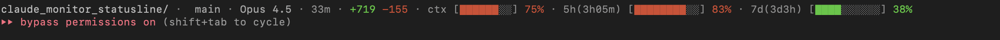

# Claude Code Statusline

A beautiful, feature-rich statusline for [Claude Code](https://claude.ai/code) with real-time usage tracking, progress bars, and smart alerts.



## Quick Install

```bash
curl -fsSL https://raw.githubusercontent.com/sanztheo/claude-code-statusline/main/install.sh | bash
```

Or with wget:
```bash
wget -qO- https://raw.githubusercontent.com/sanztheo/claude-code-statusline/main/install.sh | bash
```

Then restart Claude Code!

## Features

- **Real-time Usage Tracking** - Live progress bars showing your 5-hour and 7-day API limits
- **Context Monitor** - Know when your conversation will auto-compact (summarize)
- **Smart Color Coding** - Green → Yellow → Red as you approach limits
- **Session Stats** - Duration and lines of code added/removed
- **Git Integration** - Branch name with change indicators
- **Multiple Themes** - Colors, minimal, or background modes

## Preview

```
sanz/ · Opus 4.5 · 28m · +454 -93 · ctx [████████░░] 69% · 5h(3h09m) [███████░░░] 73% · 7d(3d3h) [████░░░░░░] 37%
```

| Component | Description |
|-----------|-------------|
| `sanz/` | Current directory |
| `Opus 4.5` | Active Claude model |
| `28m` | Session duration |
| `+454 -93` | Lines added/removed |
| `ctx [...] 69%` | Context usage (auto-compact at ~95%) |
| `5h(3h09m) [...] 73%` | 5-hour limit usage, resets in 3h09m |
| `7d(3d3h) [...] 37%` | 7-day limit usage, resets in 3d3h |

## Installation

### Prerequisites

- Ruby installed on your system
- Claude Code CLI
- macOS (for Keychain OAuth token access)

### Setup

1. **Clone this repository**
   ```bash
   git clone https://github.com/sanztheo/claude-code-statusline.git ~/.claude/utils/claude_monitor_statusline
   ```

2. **Make the script executable**
   ```bash
   chmod +x ~/.claude/utils/claude_monitor_statusline/statusline.rb
   ```

3. **Configure Claude Code**

   Add to your `~/.claude/settings.json`:
   ```json
   {
     "statusLine": {
       "type": "command",
       "command": "CLAUDE_STATUS_DISPLAY_MODE=minimal CLAUDE_STATUS_INFO_MODE=text CLAUDE_STATUS_PLAN=max5 ~/.claude/utils/claude_monitor_statusline/statusline.rb",
       "padding": 0
     }
   }
   ```

4. **Restart Claude Code** to see your new statusline!

## Configuration

### Environment Variables

| Variable | Options | Default | Description |
|----------|---------|---------|-------------|
| `CLAUDE_STATUS_DISPLAY_MODE` | `colors`, `minimal`, `background` | `colors` | Visual theme |
| `CLAUDE_STATUS_PLAN` | `pro`, `max5`, `max20` | `max5` | Your Claude plan |
| `CLAUDE_STATUS_INFO_MODE` | `none`, `emoji`, `text` | `none` | Label style |

### Plan Limits

| Plan | Token Limit | Message Limit |
|------|-------------|---------------|
| `pro` | 19k | 250 |
| `max5` | 88k | 1,000 |
| `max20` | 220k | 2,000 |

## Display Modes

### Minimal (recommended)
Clean, monochromatic design that fits any terminal theme.


### Colors
Vibrant colors for each component.


### Background
Bold colored backgrounds for maximum visibility.


## Progress Bar Colors

The progress bars automatically change color based on usage:

| Usage | Color | Status |
|-------|-------|--------|
| 0-49% | Green | Safe |
| 50-74% | Yellow | Moderate |
| 75-89% | Red | High |
| 90-100% | Bright Red | Critical |

## How It Works

### API Integration
The statusline fetches real-time usage data from the Anthropic OAuth API:
- **5-hour window** - Your rolling 5-hour usage limit
- **7-day window** - Your weekly usage quota

### Context Tracking
Parses your conversation transcript to calculate context window usage. When you approach ~95%, Claude Code auto-compacts (summarizes) the conversation.

### Git Status Indicators
- `?` - Untracked files
- `+` - Staged changes
- `!` - Modified files
- `↑n` - Commits ahead of remote
- `↓n` - Commits behind remote

## Development

### Testing Locally

```bash
echo '{
  "workspace": {"current_dir": "/Users/you/project"},
  "model": {"display_name": "Opus 4.5"},
  "session_id": "test",
  "transcript_path": "",
  "cost": {
    "total_duration_ms": 720000,
    "total_lines_added": 185,
    "total_lines_removed": 42
  }
}' | CLAUDE_STATUS_DISPLAY_MODE=minimal CLAUDE_STATUS_PLAN=max5 ruby ./statusline.rb
```

### Customizing Colors

Edit the `COLOR_SCHEMES` hash in `statusline.rb` to customize colors for each theme.

## Troubleshooting

### Statusline not showing?
- Ensure Ruby is installed: `ruby --version`
- Check script is executable: `chmod +x statusline.rb`
- Verify settings.json path is correct

### API usage not showing?
- Make sure you're logged into Claude Code (OAuth token required)
- The token is stored in macOS Keychain under "Claude Code-credentials"

### Context bar always at 0%?
- The transcript path must be valid
- Only shows after some conversation history exists

## Contributing

Contributions are welcome! Feel free to:
- Report bugs
- Suggest features
- Submit pull requests

## License

MIT License - feel free to use and modify as you like.

## Credits

Built with love for the Claude Code community.

---

**Keywords**: Claude Code, statusline, terminal, CLI, usage tracking, progress bar, API limits, context window, developer tools, productivity
