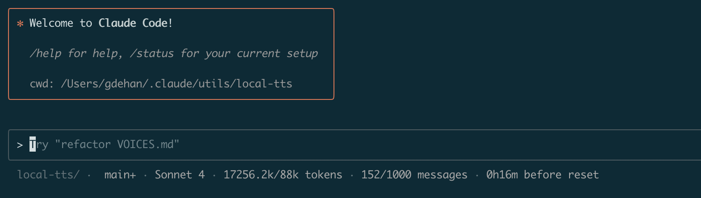
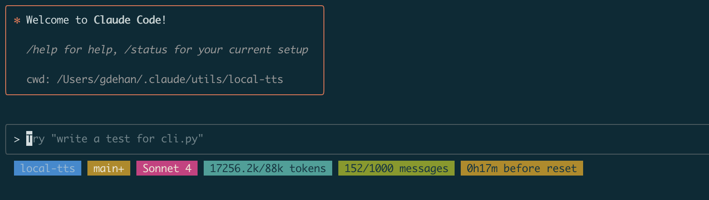

# Claude Code Status Line

A clean, customizable status line for Claude Code that displays your current folder, git status, model, but most of all: your Claude usage metrics (how many tokens and messages you have left and how long until your next reset).

## What is the Status Line?

The status line provides at-a-glance information about your Claude Code session directly in your terminal or IDE. It shows real-time usage tracking, workspace context, and git repository status to help you monitor your development workflow.

## How to setup the status line

You usually generate it when configuring Claude Code by using the `/statusline` command, but you can also reference a script from your `settings.json`.

In this case the statusline is a ruby script (so you'll need to have **ruby installed**):

```json
{
  "statusLine": {
    "type": "command",
    "command": "CLAUDE_STATUS_DISPLAY_MODE=minimal CLAUDE_STATUS_INFO_MODE=text CLAUDE_STATUS_PLAN=max5 ~/.claude/utils/claude_monitor_statusline/statusline.rb"
  }
}
```

> [!WARNING]
> Don't forget to make sure the script is executable (`chmod +x statusline.rb`)

## Features

- **Workspace Context**: Current directory name and git branch status
- **Git Status**: Branch name with change indicators (`?` untracked, `+` staged, `!` modified, `↑↓` ahead/behind)
- **Model Information**: Active Claude model display name  
- **Usage Tracking**: Token and message usage with plan limits
- **Time Remaining**: Hours/minutes until usage reset

## Display Modes

> ![INFO]
> You can edit the colors in the script to suit your tastes!

Configure the visual style with `CLAUDE_STATUS_DISPLAY_MODE`:

### `colors` (default)
Colorful, minimal display with subtle separators.


### `minimal` 
Monochromatic, understated appearance.



### `background`
Bold colored backgrounds for each component.



## Configuration Options

### Environment Variables

- `CLAUDE_STATUS_DISPLAY_MODE`: `colors` (default), `minimal`, or `background`
- `CLAUDE_STATUS_PLAN`: `pro`, `max5` (default), `max20`, or `custom`  
- `CLAUDE_STATUS_INFO_MODE`: `none` (default), `emoji`, or `text`

### Plan Types

| Plan | Token Limit | Message Limit |
|------|------------|---------------|
| `pro` | 19k | 250 |
| `max5` | 88k | 1,000 |
| `max20` | 220k | 2,000 |

### Info Modes

- **`none`**: Clean display with no extra indicators
- **`emoji`**: Adds contextual emojis (📁 🔀 🦾 📓 ✏️ ⏱️)
- **`text`**: Descriptive text labels ("tokens", "messages", "before reset")

## Development and testing 
You can change the colors and this script and debug it by using the following command: the script will read JSON input from stdin and outputs a formatted status line to stdout.

```bash
echo '{"workspace": {"current_dir": "~/some_repo_of_yours"}, "model": {"display_name": "Claude 4.1 Opus"}, "session_id": "test"}' | env CLAUDE_STATUS_DISPLAY_MODE=text CLAUDE_STATUS_PLAN=pro CLAUDE_STATUS_INFO_MODE=text ruby ./statusline.rb
```

